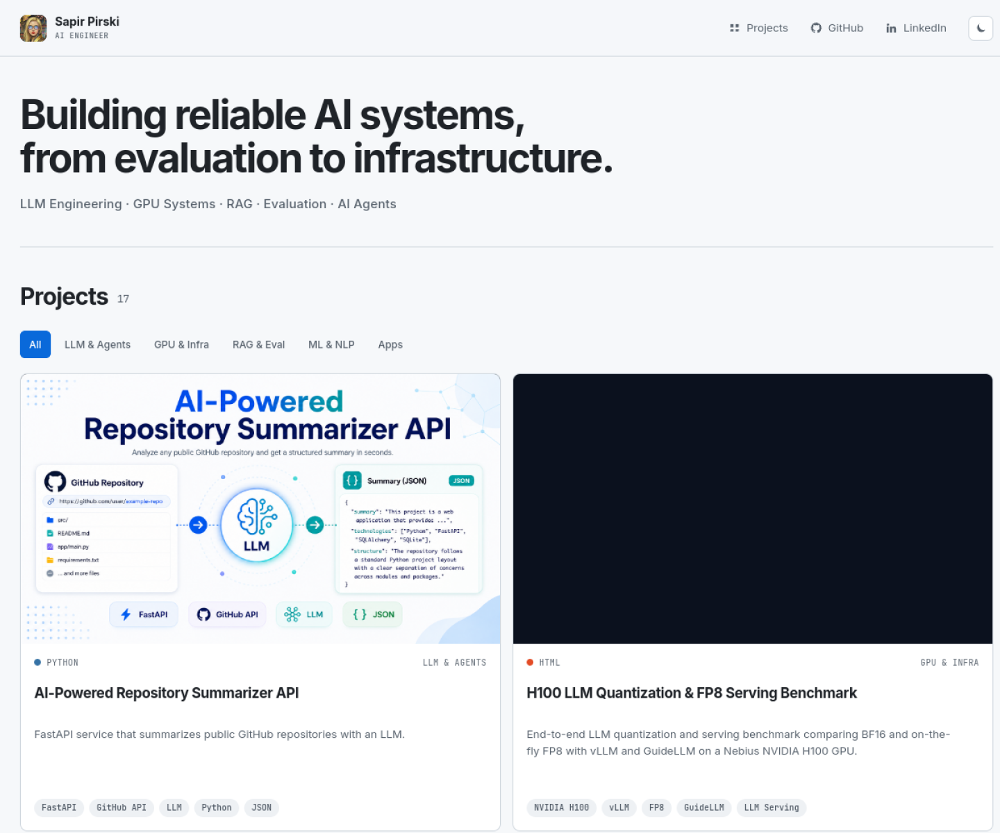
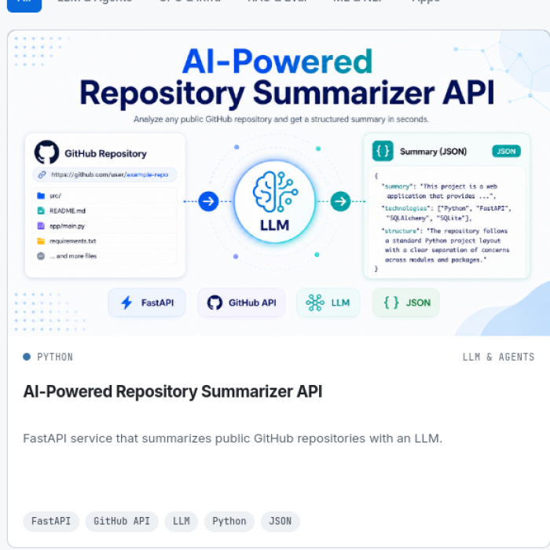

<div align="center">
  

  # Sapir Pirski — AI Engineer Portfolio

  **LLM engineering · GPU systems · RAG · evaluation · AI agents**

  A fast, responsive portfolio that turns public GitHub repositories into a curated visual showcase of production-minded AI and machine-learning work.

  [](https://sapir-pirski.github.io/)
  [](https://pages.github.com/)
  
  

  [View portfolio](https://sapir-pirski.github.io/) · [GitHub profile](https://github.com/sapir-pirski) · [LinkedIn](https://www.linkedin.com/in/sapir-pirski)
</div>

## Preview



<p align="center">
  
</p>

## What this portfolio highlights

- **LLM systems and agents** — RAG assistants, tool-using agents, RLHF, fine-tuning, and multimodal systems.
- **GPU engineering** — NVIDIA H100 inference, FP8 serving, CUDA Graphs, DDP, NCCL, and distributed training.
- **Evaluation and observability** — Ragas, SWE-bench, MLflow, Langfuse, Prometheus, and Grafana.
- **Applied machine learning** — NLP, text classification, genomic triage, and domain-specific applications.

## Experience

- Automatically loads current public repositories through the GitHub REST API.
- Applies curated project titles, artwork, categories, and five relevant skill tags per card.
- Provides category filtering for LLMs, GPU infrastructure, RAG/evaluation, ML/NLP, and applications.
- Preserves complete project artwork inside consistent 16:9 image stages.
- Supports responsive phone, tablet, and desktop layouts.
- Includes accessible light and dark themes with saved user preference.
- Makes each project card directly clickable while preserving semantic links and metadata.

## Technology

| Layer | Tools |
| --- | --- |
| Structure | Semantic HTML5 |
| Styling | Modern CSS, responsive grid, CSS custom properties |
| Client logic | Vanilla JavaScript |
| Project data | GitHub REST API |
| Typography | Inter and JetBrains Mono |
| Hosting | GitHub Pages |

## How it works

```text
GitHub REST API
      │
      ▼
Public repository metadata
      │
      ├── Category rules
      ├── Curated titles
      ├── Project artwork
      └── Skill mappings
      │
      ▼
Responsive portfolio cards
```

The site is intentionally build-free. Repository metadata stays current, while presentation details remain curated in [`index.html`](index.html).

## Run locally

```bash
git clone https://github.com/sapir-pirski/sapir-pirski.github.io.git
cd sapir-pirski.github.io
python3 -m http.server 8000
```

Open [http://localhost:8000](http://localhost:8000).

## Project structure

```text
.
├── assets/
│   ├── projects/       # Project-card artwork
│   ├── screenshots/    # README previews
│   └── github-avatar.png
├── favicon.svg
├── index.html          # Content, repository mapping, and rendering
├── styles.css          # Layout, themes, cards, and responsive behavior
└── README.md
```

## Deployment

The `main` branch is published directly with GitHub Pages. No framework build, package installation, or deployment service is required.

---

<div align="center">
  Built by <a href="https://github.com/sapir-pirski">Sapir Pirski</a>.
</div>
